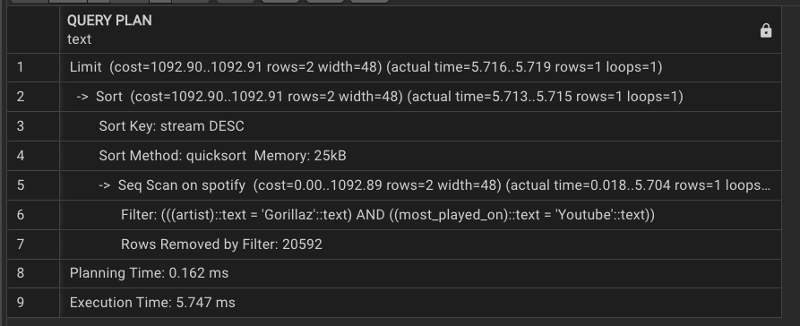
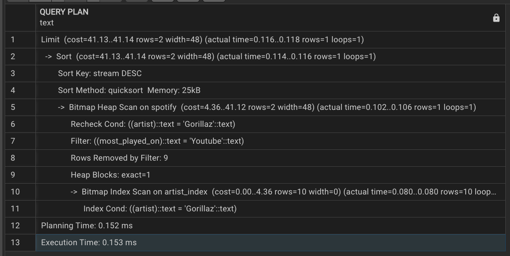
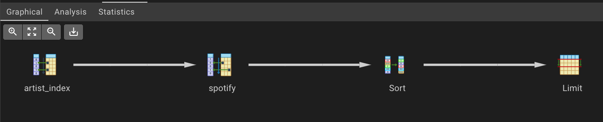

#  Spotify Data Analysis & Query Optimization using SQL

##  Objective

Analyze a Spotify dataset to extract insights on track performance, artist popularity, and platform comparison using SQL.

---

## Dataset

* Source: Kaggle
* Dataset: Spotify Tracks Dataset
* 🔗 Add your Kaggle dataset link here

---

##  Key Insights

* Identified tracks with higher Spotify streams compared to YouTube views
* Analyzed top-performing artists and albums
* Explored relationships between audio features (energy, danceability) and popularity
* Improved query performance by ~97% using indexing techniques

---

##  SQL Concepts Used

* Filtering & Sorting
* GROUP BY & Aggregations
* Subqueries
* Common Table Expressions (CTE)
* Window Functions (ROW_NUMBER, SUM OVER)
* Query Optimization (EXPLAIN, Indexing)

---

## Query Optimization Technique

To improve query performance, we analyzed and optimized SQL queries using execution plans and indexing.

---

### Before Optimization (EXPLAIN)

* Execution Time: ~5.7 ms
* Planning Time: ~0.16 ms



---

### Index Creation

```sql
CREATE INDEX idx_artist ON spotify(artist);
```

 Indexing helps faster retrieval when filtering by artist.

---

###  After Optimization

* Execution Time: ~0.153 ms
* Planning Time: ~0.152 ms



---

### Graphical Execution Plan

#### Before Index


#### After Index



#### Detailed Plan


---

##  Performance Improvement

* Significant reduction in execution time (~97%)
* Efficient data retrieval using indexing
* Reduced full table scans

---

##  How to Run

1. Install PostgreSQL and pgAdmin
2. Create database and table
3. Import dataset (CSV)
4. Execute queries from `/queries` folder
5. Use `EXPLAIN` to analyze performance
6. Apply indexing and compare results

---

##  Future Improvements

* Build dashboards using Power BI / Tableau
* Expand dataset for scalability testing
* Apply advanced optimization techniques

---
